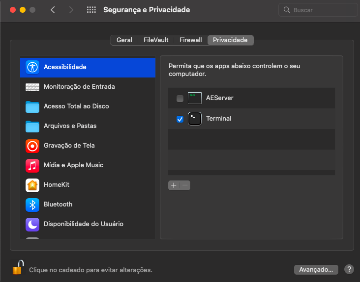
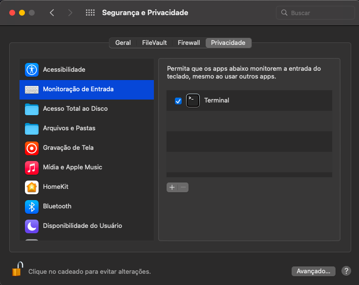

# barcode_input_simulator


[](https://jetpack.io/devbox/docs/contributor-quickstart/)

## Usage

Download from releases.

```sh
# Run json file containing array of codes
# ["code1", "code2", "code3", ...]
python barcode_input_simulator.pyz -f example.json

# Run list of codes
python barcode_input_simulator.pyz -l code1 code2 code3
```

## Development

```sh
devbox shell

pipenv install

python __main__.py -f assets/example.json
```

## Known issues

- Try running with `python3` instead `python` to avoid version and symlink errors.
- On macOS you need to trust your Terminal/IDE apps to solve error: _This process is not trusted! Input event monitoring will not be possible until it is added to accessibility clients._
  - Open **System Preferences > Security and Privacy > Privacy Tab**
  - Select **Accssibility** and **Input monitoring**
  - Click on **+** to add apps

|                                                          |                                                             |
| -------------------------------------------------------- | ----------------------------------------------------------- |
|  |  |

## Credits

- [moses-palmer/pynput](https://github.com/moses-palmer/pynput)
